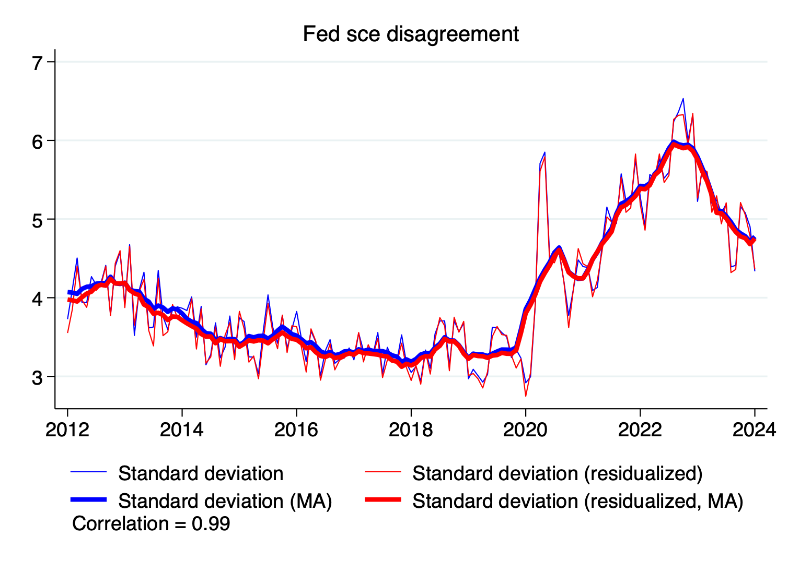
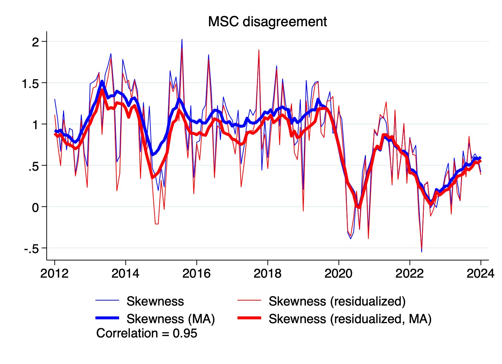
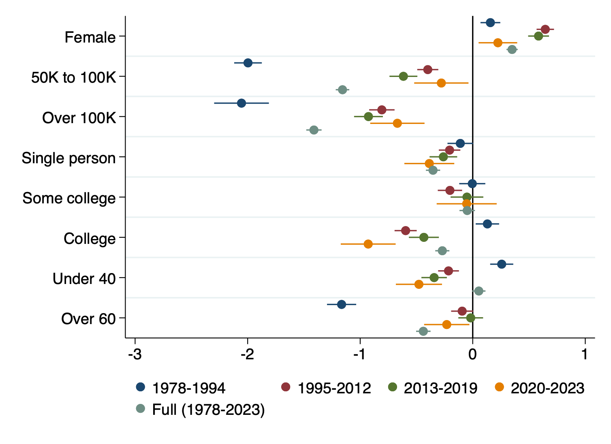
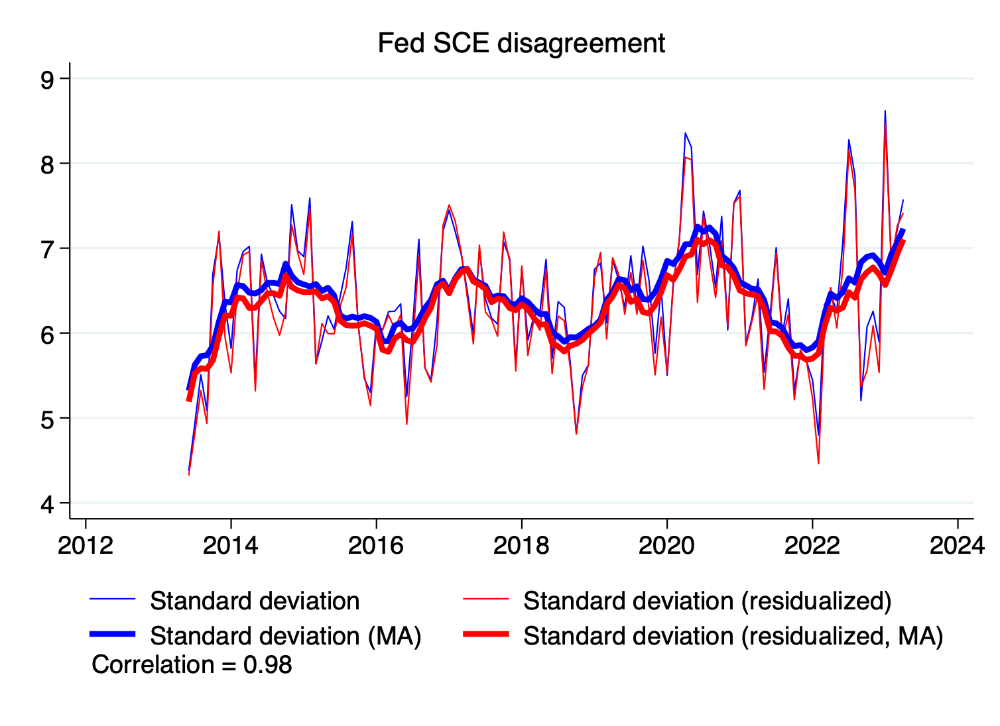
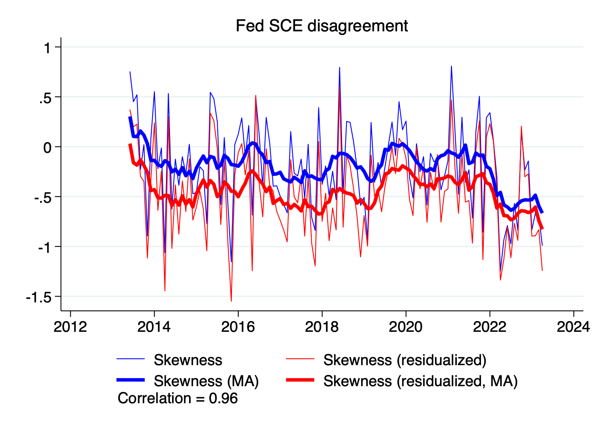
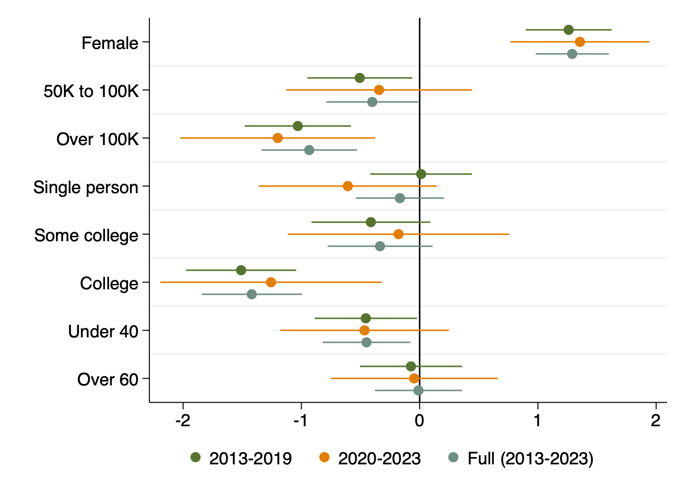
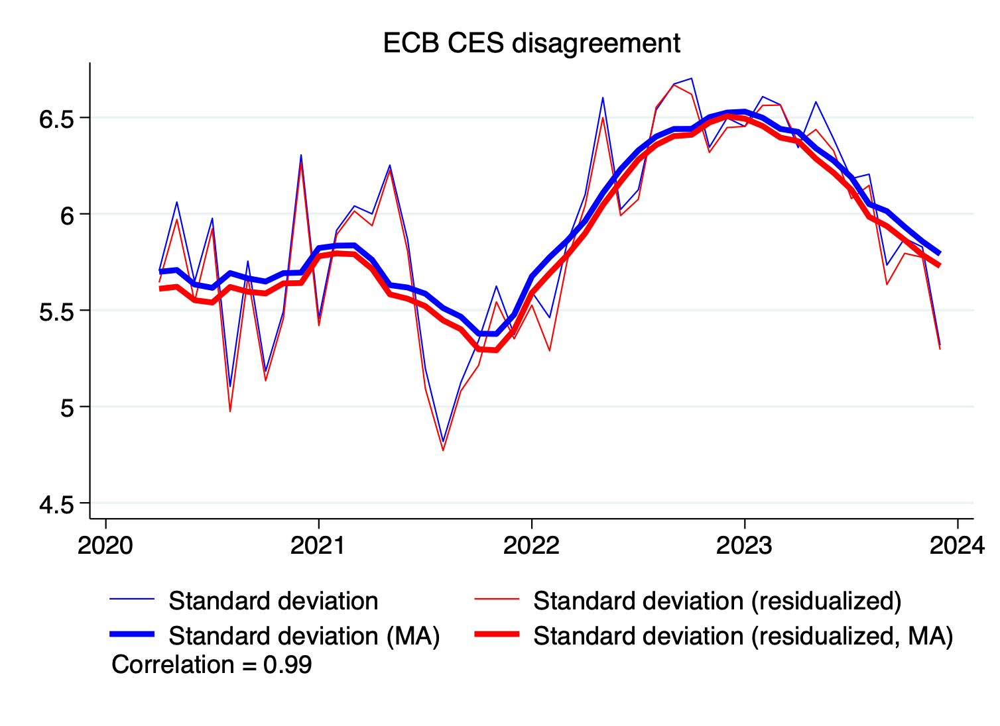
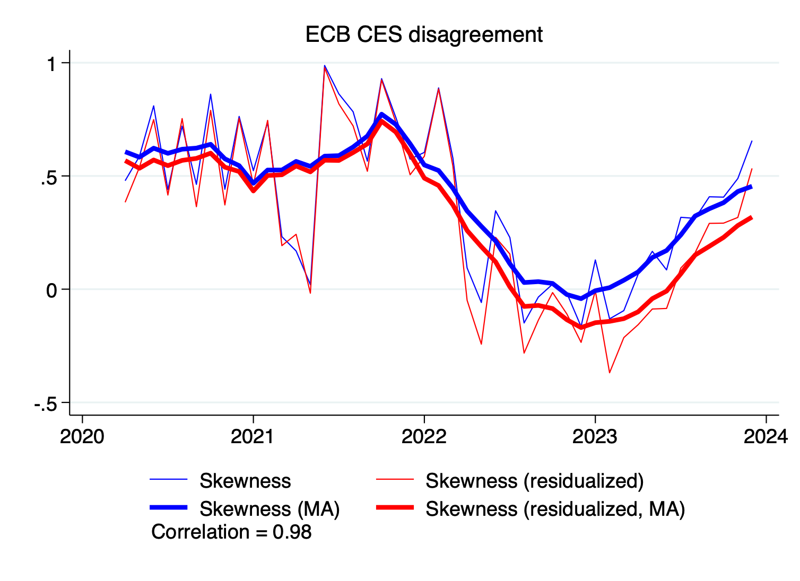
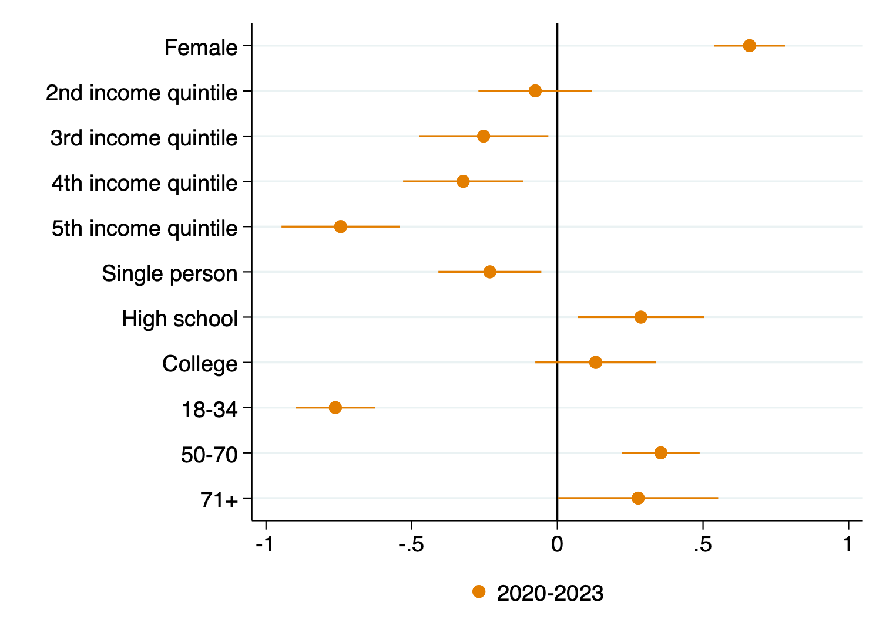
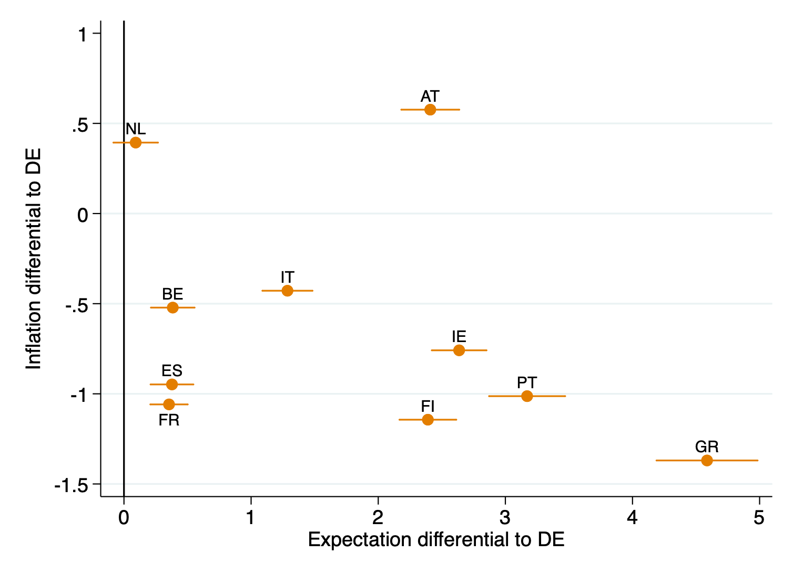

# Summary
Simple measures of disagreement in expected inflation from the Michigan survey of consumers, the FRB New York survey of consumer expectations, and the ECB consumer expectations survey. This dataset was collated from public sources, so it can be **freely used** by other researchers.

The dataset will be updated regularly to reflect the latest data.
- **Vintage 1:** The dataset was last updated in April of 2024 to cover data that ended in 2023:07 (MSC), 2023:04 (SCE), and 2023:12 (CES)

---

# Authors and Reference:
[Household Disagreement About Expected Inflation](https://personal.lse.ac.uk/reisr/papers/24-FPRdisagree.pdf) (2024). In *The Research Handbook of Inflation* edited by Guido Ascari and Riccardo Trezzi, Edward-Elgar, chapter 15.
[bibtex](https://personal.lse.ac.uk/reisr/papers/24-FPRdisagree-bib.bib)
- [Salomé Fofana](https://www.salomefofana.com)
- [Paula Pazelt](https://www.paulapatzelt.com)
- [Ricardo Reis](https://www.r2rsquared.com/)

---

# Full Dataset
Download in three formats:
- [Excel](fpr_disagree_0524.xlsx) (with meta data)
- [csv](fpr_disagree_0524.csv)
- [dta](fpr_disagree_0524.dta)

---

# Variables
The data is at the monthly frequency, and was built directly from the public access micro data files of answers.

| Column          | Description                                                                    |
|-----------------|--------------------------------------------------------------------------------|
| `date`          | Month year                                                                     |
| `st_dev`        | Standard deviation of answers                                                  |
| `skew`          | Skewness coefficient of answers                                                |
| `st_dev_resid`  | Standard deviation of residualised answers                                     |
| `skew_resid`    | Skewness of residualised answers                                               |
| `*_"survey"`    | Expectations survey (Michigan - msc, Fed SEC - sec, ECB CES - ecb)             |
| `*_ma`          | Moving average (9-month, centred)                                              |

---

# Latest Figures (as of April 2024)

## Disagreement in the Michigan survey of consumers

### Second moment (standard deviation, raw and residualized, last ten years)

Data for replication: [Excel](MSC_stdev.xls), [csv](MSC_stdev.csv), [dta](MSC_stdev.dta) 

### Higher moment (skewness, raw and residualized, last ten years)

Data for replication: [Excel](MSC_skewness.xls), [csv](MSC_skewness.csv), [dta](MSC_skewness.dta) 

### Socio-demographic-economic determinants of inflation expectations (by subsample)

---

## Disagreement in the FRB New York survey of consumer expectations 

### Second moment (standard deviation, raw and residualized)

Data for replication: [Excel](SCE_stdev.xls), [csv](SCE_stdev.csv), [dta](SCE_stdev.dta) 

### Higher moment (skewness, raw and residualized)

Data for replication: [Excel](SCE_skewness.xls), [csv](SCE_skewness.csv), [dta](SCE_skewness.dta) 

### Socio-demographic-economic determinants of inflation expectations (by subsample)

---

## Disagreement in the ECB consumer expectations survey

### Second moment (standard deviation, raw and residualized)

Data for replication: [Excel](ECB_stdev.xls), [csv](ECB_stdev.csv), [dta](ECB_stdev.dta) 

### Higher moment (skewness, raw and residualized)

Data for replication: [Excel](ECB_skewness.xls), [csv](ECB_skewness.csv), [dta](ECB_skewness.dta) 

### Socio-demographic-economic determinants of inflation expectations

---

# Usage
Please cite if use, and e-mail the authors with suggested corrections.
